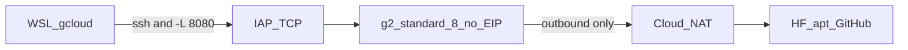

# フェーズ 11: 東京 L4 に 27B 全載せ（IAP・外部 IP なし）

フェーズ 10 でクォータは通った。GPU VM はまだ無い。このフェーズは **東京 `g2-standard-8` 1 台** に 27B Q4 を全載せし、外部 IP なしで SSH と計測まで通す。

create / stop / delete は **このリポジトリ** の `scripts/gcp/`。新規リポは作らない。`google-cloud-skill-challenge` には入れない。

- 依存: フェーズ 7 の 27B 部分 GPU（3.7 tok/s）、フェーズ 10 のクォータ。手元 GGUF `~/models/Qwen3.8-27B-UD-Q4_K_M.gguf`（16G）
- GPU（ローカル）: 不要。計測はクラウド L4
- 課金: ワンショット検証の上限は **$10**（GPU 時間 + NAT データが本体）。`g2-standard-8` は create した瞬間から約 **$1.10/h**（≈ 9h で $10）。計測の直後に **stop**。ディスクは消さない

## 確定（2026-09-15）

| 項目 | 値 |
| --- | --- |
| リージョン | `asia-northeast1`（東京）。a → b → c のみ |
| 機種 | `g2-standard-8`（L4 24GB / 8 vCPU / RAM 32GB）1 台 |
| モデル（初回） | `Qwen3.8-27B-UD-Q4_K_M.gguf`、`-ngl 99`（GPU に載せる層数。99 は実質全層） |
| 入り | IAP TCP（Identity-Aware Proxy。Google アカウントで SSH を包む）。`--tunnel-through-iap` |
| VM の IP | `--no-address`（外部 IP なし。org policy で付けられない） |
| 出 | 東京 Cloud NAT（apt / GitHub / 必要なら HF） |
| 予算（今回） | **$10** まで。GPU 常時起動は不可（数時間で超える）。pd-balanced 100GB は残す |
| 使わない | Iowa / 台湾 / ソウル、Spot、踏み台 VM、`0.0.0.0` 公開、`restart-on-failure`、ディスク削除で $10 を削ること |

紙上の decode は L4 帯域 300 GB/s から **約 15 tok/s**。未実測。この作業で数値にする。

## この作業で確定すること

1. 外部 IP なしで IAP SSH が通ること
2. GGUF が VM に届くこと（**HF からの取得は未検証**。下の「モデル配置」）
3. L4 全載せの実測 tok/s と VRAM
4. create 直後に stop できること。起動時間あたりの実費。**$10 を超えないこと**

やらなかったこと（このフェーズ）: 9B をクラウドに載せる、35B-A3B の取得、A100、帯域カタログ HTML の本文、Cloud Run の変更。

## ポリシーが弾いたとき

org policy / IAM / API で create・NAT・IAP が失敗したら、**回避策を実装しない。チャットで止めて質問する。** 人がポリシーを緩める。

やらないこと（裏口）:

- 外部 IP を一時的に付ける、`vmExternalIpAccess` を agent が変える
- 踏み台 VM、別リージョン、別プロジェクトへ逃げる
- NAT が弾かれたら「全部 scp で済ませる」へ自動切替
- llama-server を `0.0.0.0` や IAP 範囲の 8080 に直接開ける
- `instances.insert` の dryRun（フェーズ 10 で CPU が実体化した）
- 東京 a/b/c が在庫切れでも Iowa へ行かない

質問する内容の例: 失敗した API とエラー本文、今の org policy 名、人が直す候補（NAT 許可 / IAP API / ファイアウォール）。直るまで次のステップに進まない。

## 使い方（入と出）



llama-server を後で見る場合も bind は `127.0.0.1:8080`。ブラウザは WSL 側の `-L` 経由。

## 置き場所

フェーズ 10 は別リポ案だった。再検討して撤回した。理由: この作業の本体はフェーズ 7 の 3.7 tok/s と L4 全載せの比較で、手順・プロンプト・計測の置き場はすでにここにある。クォータ記録も [`../results/10-gcp-27b.md`](../results/10-gcp-27b.md) にある。スクリプトは 4 本で、別 git に分けるほど独立した製品ではない。stop 忘れはリポ境界では防げない。同じワークスペースに `stop.sh` がある方が見つけやすい。

入れない: `google-cloud-skill-challenge`（同じ `monzi-sandbox` の Cloud Run 本番。`delete` を本番デプロイと同じ履歴に混ぜない）。

| 何 | どこ |
| --- | --- |
| この手順 | このファイル |
| create / stop / delete / IAP ssh | [`../scripts/gcp/`](../scripts/gcp/) |
| 実測 tok/s | [`../results/11-gcp-l4.md`](../results/11-gcp-l4.md)（未作成） |
| 帯域の学習ノート | [`../notes/learn-bandwidth.html`](../notes/learn-bandwidth.html)（VM 手順の前提ではない。別作業） |

最初に置くスクリプト:

- `scripts/gcp/create.sh`（東京 `g2-standard-8`、`--no-address`、`--maintenance-policy=TERMINATE`、tag `allow-iap-ssh`、pd-balanced 100GB、ゾーン a→b→c）
- `scripts/gcp/stop.sh` / `scripts/gcp/delete.sh`
- `scripts/gcp/ssh.sh`（`--tunnel-through-iap`。任意で `-L 8080:127.0.0.1:8080`）

README の料金・stop 注意はフェーズ MD と `results/11` に書く。別リポ用 README は作らない。

delete は人が「VM ごと消す」と言うまで打たない。ブートディスク（GGUF 込み）は stop 後も載せておく。GPU は常時起動しない。

## 実施順

コマンドはすべて `--project=monzi-sandbox`。本番 Cloud Run は触らない。

### 1. 読み取り（GPU 課金なし）

クォータ・EIP 禁止・既存 NAT / IAP / fw を見て、`results/11-gcp-l4.md` の冒頭に写す。create はまだしない。

```bash
gcloud config get-value project
# 合格: monzi-sandbox

gcloud compute project-info describe --project=monzi-sandbox \
  --format=json | jq '{gpus: [.quotas[]? | select(.metric|test("GPUS"))]}'
gcloud compute regions describe asia-northeast1 --project=monzi-sandbox \
  --format=json | jq '[.quotas[] | select(.metric|test("NVIDIA_L4|PREEMPTIBLE|CPUS"))]'

gcloud org-policies describe compute.vmExternalIpAccess --project=monzi-sandbox
gcloud org-policies describe compute.restrictCloudNATUsage --project=monzi-sandbox

gcloud compute routers list --project=monzi-sandbox --filter='region:asia-northeast1'
gcloud compute firewall-rules list --project=monzi-sandbox \
  --filter='network=default'
gcloud services list --project=monzi-sandbox --filter='config.name:iap.googleapis.com'
```

見る場所: `GPUS_ALL_REGIONS` limit 1 / usage 0。東京 `NVIDIA_L4_GPUS` limit 1。EIP は deny。NAT 制約が default 全許可なら次へ。IAP API が無ければ有効化してよいか質問する（無断 enable しない、というより IAP 必須なので **有効化は本筋**。org policy で弾かれたら質問）。

`default-allow-ssh`（`0.0.0.0/0:22`）は **消してよい**。Cloud Run は GCE の 22 番に依存しない。当初の「本番用 default は触らない」は過剰だった。VM は空で、SSH は IAP 以外に使わない。順は **IAP 用ルールを先に作る → そのあと default-allow-ssh を消す**。`default-allow-internal` は消さない。

### 2. スクリプト

`scripts/gcp/` に 4 本を置く。この時点では create を実行しない。

create の骨格:

```bash
gcloud compute instances create l4-27b \
  --project=monzi-sandbox --zone=asia-northeast1-a \
  --machine-type=g2-standard-8 \
  --accelerator=count=1,type=nvidia-l4 \
  --maintenance-policy=TERMINATE \
  --boot-disk-size=100 --boot-disk-type=pd-balanced \
  --image-family=common-cu129-ubuntu-2204-nvidia-580 \
  --image-project=deeplearning-platform-release \
  --no-address --tags=allow-iap-ssh
```

ゾーンは在庫で a → b → c。3 つとも `ZONE_RESOURCE_POOL_EXHAUSTED` なら **止めて記録**。他リージョンへは行かない。

### 3. IAP 用 fw と東京 Cloud NAT（GPU なし）

失敗したら質問。予備経路へ進まない。

```bash
gcloud services enable iap.googleapis.com --project=monzi-sandbox

gcloud compute firewall-rules create allow-ssh-from-iap \
  --project=monzi-sandbox --network=default \
  --direction=INGRESS --action=ALLOW \
  --rules=tcp:22 --source-ranges=35.235.240.0/20 \
  --target-tags=allow-iap-ssh

gcloud compute routers create nat-router-tokyo \
  --project=monzi-sandbox --region=asia-northeast1 --network=default
gcloud compute routers nats create nat-config \
  --project=monzi-sandbox --router=nat-router-tokyo \
  --router-region=asia-northeast1 \
  --nat-all-subnet-ip-ranges --auto-allocate-nat-external-ips
```

IAM は Owner なので `iap.tunnelResourceAccessor` は足りる想定。足りなければ質問。

### 4. create → IAP SSH → nvidia-smi

```bash
# scripts/create.sh（ゾーン a。失敗したら b, c）

gcloud compute instances describe l4-27b \
  --project=monzi-sandbox --zone=ZONE \
  --format='yaml(networkInterfaces,status)'
# 合格: accessConfigs が無い。status RUNNING

gcloud compute ssh l4-27b --project=monzi-sandbox --zone=ZONE \
  --tunnel-through-iap --command='nvidia-smi'
# 合格: NVIDIA L4、メモリ 24564 MiB 級
```

SSH が弾かれたら fw / IAP API / OS Login / タグを読んで質問。外部 IP は付けない。

### 5. モデル配置（未検証）

手元の 16G を IAP scp するのは **第一候補にしない**。家の上りを 16G 分使い、そのあいだ L4 が `$1.10/h` で待つ。IAP TCP は公式にバルク転送向けではない（[rate-limit あり](https://docs.cloud.google.com/iap/docs/using-tcp-forwarding)）。

第一候補: VM が Cloud NAT 経由で Hugging Face から取る（東京データセンタの下り。家の回線は使わない）。

```bash
# IAP SSH した VM 上。トークンをディスクに書かない
mkdir -p ~/models
# huggingface_hub が無ければ pip で入れる（失敗したら質問）
hf download unsloth/Qwen3.8-27B-GGUF Qwen3.8-27B-UD-Q4_K_M.gguf \
  --local-dir ~/models
ls -lh ~/models/Qwen3.8-27B-UD-Q4_K_M.gguf
# 合格: 約 16G
```

公開リポなので `HF_TOKEN` は必須ではない。レート制限で lag したら、**ディスクに login せず** 質問する（環境変数 1 回だけ渡すかは人）。git や VM の `~/.cache` にトークンを残さない。

見る場所: ファイルサイズ。NAT データ処理は 16 GiB で約 **$0.72**（`$0.045/GiB`）。L4 待ち 1 時間より安いことが多い。失敗したら scp へ自動切替しない。質問する。

llama.cpp の Linux CUDA zip も NAT 経由で公式から取る（L4 は Ada。WSL Blackwell と違い公式バイナリがある）。これも未検証。失敗したら質問。

### 6. ベンチ 1 本 → 即 stop

フェーズ 7 と同じ greedy・同じ ja プロンプト。`-ngl 99`、`-c 2048`、`--reasoning off`。対話目安は 8 tok/s。紙上 15 との差を記録する。

```bash
# VM 上。パスは配置後に確定
llama-cli -m ~/models/Qwen3.8-27B-UD-Q4_K_M.gguf \
  -ngl 99 -c 2048 --reasoning off \
  -n 128 --temp 0 \
  -p "$(cat prompt-ja.txt)"
```

プロンプト本文は [`../results/05-prompt-ja.txt`](../results/05-prompt-ja.txt)。timings の Prompt eval / eval time と `nvidia-smi` の VRAM を [`../results/11-gcp-l4.md`](../results/11-gcp-l4.md) に写す。

終わったら **即 stop**（delete ではない。ディスクと GGUF は残す）。

```bash
gcloud compute instances stop l4-27b --project=monzi-sandbox --zone=ZONE
gcloud compute instances describe l4-27b \
  --project=monzi-sandbox --zone=ZONE --format='yaml(status)'
# 合格: TERMINATED
```

HF 取得やベンチが長引いて GPU 時間が **8h に近づいたら stop して質問**する（$10 ≈ 9h）。

## 料金（ワンショット $10）

正本: [accelerator-optimized](https://cloud.google.com/products/compute/pricing/accelerator-optimized)。為替は書かない。Spot はこのプロジェクトでは使えない（`PREEMPTIBLE_CPUS=0`）。

今回の上限は **$10**。中身はほぼ L4 の起動時間。想定の一回:

| 項目 | 目安 | $10 との関係 |
| --- | --- | --- |
| g2-standard-8 2h | 2 × $1.0962 ≈ **$2.2** | 本命。8h 超えたら止めて質問 |
| Cloud NAT 16G | 約 **$0.72** | HF 1 回分。ディスクに残すので再取得しない |
| NAT ゲートウェイ + NAT IP | 誤差（数 cent / 数時間） | GPU なしで先に作ってよい |
| pd-balanced 100GB | **$13 / 月**（stop 中も） | **$10 枠の外**。微量扱いで常時載せる。消して $10 を守る必要はない |

GPU を止めないと $10 は約 **9h** で終わる。ディスクを残すことでは $10 は守れない（月額の方が大きい）。守るのは **RUNNING を短くすること**。

24/7 起動は約 $800/月。ワンショットの対象外。

## 合格条件

- [x] `scripts/gcp/` に create / stop / delete / ssh がある。`google-cloud-skill-challenge` には入れてない
- [x] IAP fw（`35.235.240.0/20:22`）と東京 Cloud NAT がある
- [x] `l4-27b` に `accessConfigs` が無い。IAP SSH で `nvidia-smi` が L4 を返す
- [x] 27B GGUF が VM にあり、配置は **HF + NAT**（失敗時は質問。scp へ自動切替していない）
- [x] `-ngl 99` の timings と VRAM がある。測った直後に status が `TERMINATED`
- [x] 東京 3 ゾーン在庫切れ・ポリシー失敗では止めて質問した。Iowa に逃げていない
- [x] Cloud Run を触っていない。ディスクは残している（delete していない）
- [x] この回の GPU+NAT が **$10 を超えていない**（8h 近くなったら stop して質問した）

## 失敗したとき

| 現象 | まず疑うこと | 次 |
| --- | --- | --- |
| org policy / IAM で create・NAT・IAP が 403 | 人が直すポリシー | **質問して止まる** |
| `ZONE_RESOURCE_POOL_EXHAUSTED` | 東京の在庫 | a→b→c。ダメなら記録して止まる |
| `Quota 'GPUS_ALL_REGIONS' exceeded` | 既に GPU VM が 1 台 | 2 台目を作っていないか |
| SSH タイムアウト | IAP fw、タグ `allow-iap-ssh`、IAP API | 外部 IP は付けない。質問 |
| VM から apt / GitHub が出られない | NAT 未作成 or ポリシー | 質問。scp への自動切替はしない |
| GGUF が届かない | HF / NAT / レート制限 | 質問（IAP scp に切替えるかは人） |
| VRAM OOM / ngl 99 が載らない | 見積 18–22 GB が甘い | ctx を落とす前に数値を残して質問 |
| GPU 時間が 8h に近い | HF 取得の停滞、stop 忘れ | **即 stop**。$10 を超える前に質問 |

## スコープ外

- A100 / H100 / 9B クラウド / 35B-A3B の初回取得
- Iowa / 台湾 / ソウルの GPU VM、他リージョンの L4 クォータ申請
- Spot、Vertex AI、ビジョン mmproj
- Cloud Run と Firestore
- `notes/learn-bandwidth.html` の執筆（別作業。VRAM と帯域を取り違えない表）

## 成果物

- このファイル
- `scripts/gcp/create.sh` / `stop.sh` / `delete.sh` / `ssh.sh`
- [`../results/11-gcp-l4.md`](../results/11-gcp-l4.md)
