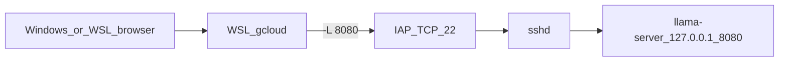

# フェーズ 12: IAP トンネルで llama-server（L4 27B）

フェーズ 11 は `llama-cli` 1 本の timings。このフェーズは同じ VM 上の **llama-server** を、外部 IP なしのまま手元ブラウザで 1 往復する。

- 依存: フェーズ 11 の `l4-27b`（ディスクに GGUF と CUDA ビルド済み）。VM は stop してある想定
- GPU: クラウド L4。ローカル GPU は使わない
- 課金: start した瞬間から約 **$1.10/h**。試したら **即 stop**。ディスクは消さない

## 確定

| 項目 | 値 |
| --- | --- |
| 入り | IAP SSH の `-L`（手元 loopback → VM の `127.0.0.1:8080`） |
| llama-server bind | **`127.0.0.1:8080` のみ** |
| モデル | `Qwen3.8-27B-UD-Q4_K_M.gguf`、`-ngl 99 -c 2048 --reasoning off --webui` |
| 使わない | `0.0.0.0`、fw の 8080、`start-iap-tunnel 8080`、Cloudflare / ngrok、外部 IP、delete |

**IAP TCP を 8080 に直接開けない理由**: `gcloud compute start-iap-tunnel … 8080` は VM の **内部 NIC** に届く。`127.0.0.1` 待ちのプロセスは受け取れない。fw に 8080 を足す必要も出る。SSH `-L` なら転送先はリモート側 loopback なので、いまの `allow-ssh-from-iap`（22 だけ）で足りる。



## この作業で確定すること

1. stop 済みの `l4-27b` を `start` して IAP SSH が戻ること
2. `llama-server` がディスク上にあること（無ければ全 CUDA 再ビルドせず、そのターゲットだけ）
3. トンネル経由で付属 Web UI が開き、日本語 1 往復できること
4. 終わったら status が `TERMINATED`

やらなかったこと: ctx を大きくする、9B をクラウドに載せる、インターネット公開。

## ポリシーが弾いたとき

失敗したら裏口に行かない。チャットで止めて質問する。やらないこと: 外部 IP、8080 の fw、`0.0.0.0` bind。

## 手順

コマンドはすべて `--project=monzi-sandbox`。本番 Cloud Run は触らない。

### 1. start（ここから GPU 課金）

```bash
scripts/gcp/start.sh
# 合格: status: RUNNING、zone は前回と同じ（東京 c）
```

`create.sh` は呼ばない。VM が無いならフェーズ 11 に戻る。

### 2. IAP SSH → GPU とバイナリ

```bash
scripts/gcp/ssh.sh --command='nvidia-smi'
# 合格: NVIDIA L4

scripts/gcp/ssh.sh --command='test -x ~/opt/llama.cpp/build/bin/llama-server && ~/opt/llama.cpp/build/bin/llama-server --version; ls -lh ~/models/Qwen3.8-27B-UD-Q4_K_M.gguf'
```

`llama-server` が無ければ、オブジェクトは残っている想定なのでそのターゲットだけ足す。全 SM 向けの初回ビルド（約 1 時間）は繰り返さない。

```bash
# 無いときだけ。IAP SSH した VM 上
cmake --build ~/opt/llama.cpp/build --target llama-server -j"$(nproc)"
```

### 3. VM 上で llama-server

別の IAP SSH を開いたまま待つ。bind は `127.0.0.1`。

```bash
scripts/gcp/ssh.sh
# VM 上:
mkdir -p "$HOME/logs"
~/opt/llama.cpp/build/bin/llama-server \
  -m "$HOME/models/Qwen3.8-27B-UD-Q4_K_M.gguf" \
  --alias qwen3.8-27b \
  --host 127.0.0.1 \
  --port 8080 \
  --webui \
  -ngl 99 -c 2048 --reasoning off \
  2>&1 | tee "$HOME/logs/llama-server.log"
```

合格: ログ `listening on http://127.0.0.1:8080`。`nvidia-smi` の used はベンチ級（約 15 GiB）。

### 4. 手元でトンネル

サーバを動かした SSH とは **別プロセス**。`-N` なのでリモートシェルは開かない。

```bash
scripts/gcp/tunnel.sh
# 手元 8080 がローカル serve.sh で埋まっていたら:
# LOCAL_PORT=18080 scripts/gcp/tunnel.sh
```

### 5. ブラウザ 1 往復

- `http://127.0.0.1:8080`（Windows は mirrored なら同じ URL。ずらしたらそのポート）
- WSL: `curl -sS http://127.0.0.1:8080/health`
- 日本語を 1 往復。体感はフェーズ 11 の **14.5 tok/s** 前後

### 6. 即 stop

llama-server を Ctrl+C、トンネルも Ctrl+C。

```bash
scripts/gcp/stop.sh
# 合格: status: TERMINATED
```

チャットを置いたまま RUNNING にしない。

## 合格条件

- [x] `scripts/gcp/start.sh` / `tunnel.sh` がある。create / 8080 fw は増えていない
- [x] start 後に IAP SSH と `nvidia-smi` が L4 を返す
- [x] llama-server は `127.0.0.1:8080`。トンネル経由で UI または `/health` が通る
- [x] 日本語 1 往復（遅くてよい。公開 URL ではない）
- [x] 測ったあとに status が `TERMINATED`

## 失敗したとき

| 現象 | まず疑うこと | 次 |
| --- | --- | --- |
| start が 403 / 在庫切れ | クォータ、東京 c の L4 | **質問して止まる**。Iowa へ行かない |
| SSH タイムアウト | IAP fw、タグ、IAP API | 外部 IP は付けない。質問 |
| `llama-server` が無い | cmake 既定に入っていない | そのターゲットだけビルド。全再ビルドしない |
| トンネルは立つが UI が白い | 手元 8080 が別プロセス、またはサーバ未起動 | `ss -ltn` とサーバログ |
| `Connection refused` | bind が `127.0.0.1` なのに IAP TCP 8080 を使った | `tunnel.sh`（SSH `-L`）に戻す。fw は開けない |
| VRAM OOM | ctx が 2048 より大きい | ctx を落とす前に数値を残して質問 |

## 成果物

- [`../scripts/gcp/start.sh`](../scripts/gcp/start.sh) / [`../scripts/gcp/tunnel.sh`](../scripts/gcp/tunnel.sh)
- このファイル
- [`../results/12-gcp-webui.md`](../results/12-gcp-webui.md)
